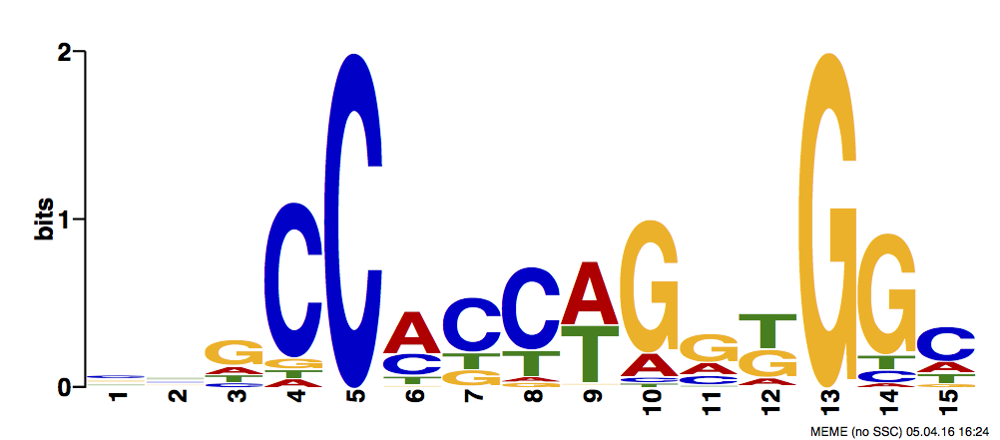

# Overview

For this problem set you will need to analyze some ChIP-seq data to
identify a mystery factor X.

## Workflow

Create a `run.sh` file that runs the entire workflow (or as much as possible).

### Alignment

Align FASTQ data to the human genome with bowtie2. There are two files
in the `data/` directory:

```
data/factorx.chr1.fq.gz
data/hg19.chr1.fa.gz
```

First build a bowtie2 index with `bowtie2-build` and use `bowtie2` and `samtools` to align the reads to the index.

**The output of the alignment step is a sorted BAM file.**

### Create bedGraph

Create a bedGraph file from the sorted BAM files. Use the
`bedGraphToBigWig` utility and the `hg19.chrom.size` file in the `data/`
directory.

### Create a track in the UCSC browser

1. Create a branch in your forked repository called `gh-pages`:

```bash
$ git branch gh-pages
$ git push origin gh-pages
```

1. Go to the browser and add a "custom track" in the `hg19` genome build.
your trackline should look something like this (all on one line):

```
track type=bigWig bigDataUrl="http:/mandylr.github.io/problem-set-4/results/factorx.bw"" color=255,0,0 visiblity=full name='chip data' description='chip description'
```

### Peak calling

Call peaks from the bedGraph data using MACS2.

```bash
$ macs2 callpeak -t <BAM file>
```

### Generate motifs from the peak calls

1. Use these peak calls to collect FASTA sequences with `bedtools getfasta`.

1. Derive motifs from the FASTA sequences with `meme`.

*Note: This takes a __very__ long time to run!*
```bash
# if you get an error about "max size" add -maxsize 1000000
$ meme <FASTA file> -nmotifs 1 -maxw 20 -minw 8 -dna 
```

1. Extract the motif from the `meme.txt` output and use TOMTOM to identify
the motif match. You can use the `meme-get-motif` to extract the first motif from the file:

*Note: The meme.txt file was empty, so I uploaded the meme.html document to TOMTOM to get the motif*

```bash
meme-get-motif -id 1 < meme.txt
```

Copy the numeric matrix into the the search box on the tomtom site and report which motif it matches.

##Results

####Motif from meme


####TOMTOM results matched __CTCF__ motif


###Ran meme with a subset of 1000 peaks. 

`bash shuf results/factorx.summits.windows.bed | head -n 1000 > results/peaks.rand.1000.bed`

`bash bedtools getfasta -fi data/hg19.chr1.fa -bed results/peaks.rand.1000.bed -fo results/peaks.rand.1000.fa`

`bash meme results/peaks.rand.1000.fa -nmotifs 1 -maxw 20 -minw 8 -dna -maxsize 10000000 -o results/meme_shuff`



####The subset of 1000 TOMTOM results match __CTCF__ motif

I uploaded the `meme_shuf/meme.html` file to TOMTOM motif finder and it resulted in a match to __CTCF__. 


